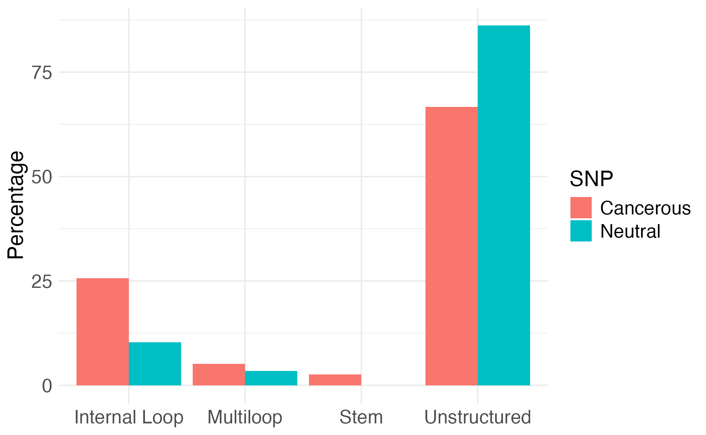

# RNA mutations

### Unlocking the Power of ncRNA--Classifying Pathogenic SNPs for Next-Generation Treatments 

Our solution addresses the challenge of predicting and personalizing cancer treatment by focusing on non-coding RNA (ncRNA) variants. Despite the critical role of ncRNA in gene regulation and cancer pathology, it remains underexplored compared to protein and coding RNA mutations. Advancing innovation in this area is crucial for enhancing precision medicine and improving patient outcomes, particularly in breast cancer. 

We leveraged deep learning to evaluate how mutations disrupt the structural integrity of ncRNA and assess their potential pathogenicity in cancer. Drawing an analogy to a “banana,” we hypothesized that mutations in specific structural regions—such as the surface or tips of the RNA may have a disproportionate impact on RNA function, just as a small change at the tip of a banana may cause a larger structural shift. Our approach utilized the pre-trained RNA-FM model to encode ncRNA sequences into a high-dimensional feature space, capturing both sequential and evolutionary information. These features serve as inputs to a predictive model trained on SNPs associated with cancer survival (ncRNA-eQTL) and neural SNPs (dbSNP) databases. 

Overall, our approach identifies druggable regions within ncRNA, pinpointing structural vulnerabilities that could serve as novel therapeutic targets. In breast cancer certain SNPs in ncRNA have been identified that disrupt the secondary structure of the RNA, impairing tumor suppressor genes. These mutations may contribute to tumor progression, highlighting the potential importance of ncRNA variants in cancer treatment. This has the potential to transform personalized oncology treatment by identifying key biomarkers and guiding targeted therapeutic strategies across multiple disease types.

### Workflow for Annotating Cancerous and Common SNPs on ncRNA Using RNA Secondary Structure Prediction

1. Data Collection

- Cancerous SNPs: Extracted from the survival-eQTL dataset of the [ncRNA-eQTL Database](https://www.ncRNA-eQTL-database-url.com).

- Neutral SNPs: Obtained from the snp151common dataset of the [dbSNP Database](https://www.ncbi.nlm.nih.gov/SNP/).

- ncRNA transcript sequences: Homo sapiens version GRCh38

2. RNA Secondary Structure Prediction

- Model: Utilize the pretrained deep learning model [RNA-FM](https://github.com/ml4bio/RNA-FM) to predict RNA secondary structures. The model was trained on 23 million ncRNA sequences from 800 species.

- Input: ncRNA sequences with annotated SNPs.

- Output: Pair-wise binding probability.

3. Feature Extraction

- Extract secondary structure annotation in [DSSR-style](https://x3dna.org) labels using python-based scripts.

  - Stem (S) → Paired bases in a helix (( )).
  - Hairpin loop (H) → Unpaired bases enclosed by a single closing pair.
  - Bulge (B) → Unpaired bases interrupting a stem on one side.
  - Internal Loop (I) → Unpaired bases interrupting a stem on both sides.
  - Multiloop (M) → Unpaired bases with multiple branching stems.
  - Unstructured (U) → Unpaired bases not in any specific loop.

4. SNP Selection Processing

- Raw SNP Data:
  - Cancerous SNPs: 1001  
  - Neutral SNPs: 244,044  

- Exclusion Criteria:

  Excluded SNPs not within exons of ncRNA:
   - Cancerous SNPs: 79
   - Neutral SNPs: 77

  Excluded SNPs that failed to be processed by RNA-FM due to long transcript lengths:
   - Cancerous SNPs: 39
   - Neutral SNPs: 29

5. Analysis and Interpretation

- Compare structural changes between cancerous and neutral SNPs.

<figure>
  
  <figcaption>Cancerous SNPs were found more frequent in structured features</figcaption>
</figure>
